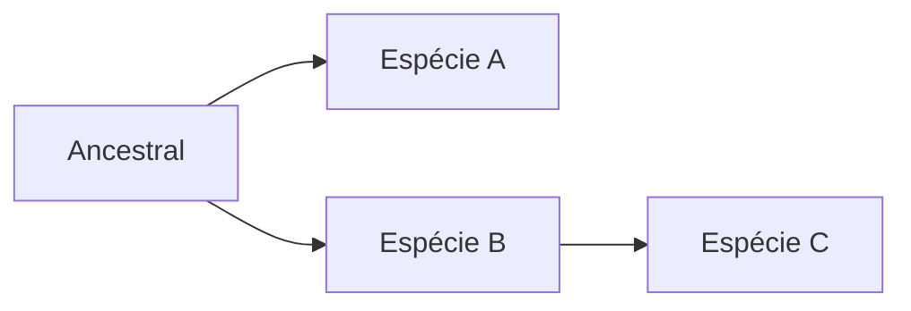

# Título
Isso é um parágrafo

## Subtítulo
Isso é um parágrafo

Isso é uma lista ordenada:

1. Primeiro item
2. Segundo item
3. Terceiro item

### Agora uma lista não ordenada

- Item 1
- Item 2
- Item 3

> Comentário sobre o texto

**Negrito** 

*Itálico*

`destaque`

```
Citação longa
com muitas linhas
tldr
```

