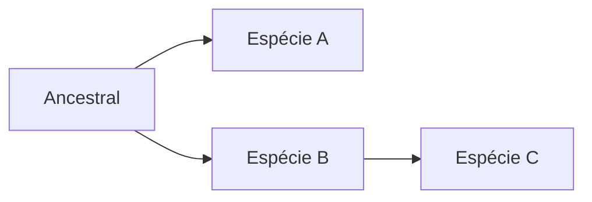

# Título

Isso é um parágrafo

> Site [Mermaid](https://mermaid.js.org/syntax/flowchart.html) para gráficos
>
> Site [Markdown](https://www.markdownguide.org/basic-syntax/) para markdown
>
> Site [Extensões](https://facelessuser.github.io/pymdown-extensions/extensions/arithmatex/)

## Subtítulo

Isso é um parágrafo

Isso é uma lista ordenada:

1. Primeiro item
2. Segundo item
3. Terceiro item

### Agora uma lista não ordenada

- Item 1
- Item 2
- Item 3

> Comentário sobre o texto

**Negrito**

*Itálico*

`destaque`

```text
Citação longa
com muitas linhas
tldr
```



```math
\begin{align}
    p(v_i=1|\mathbf{h}) & = \sigma\left(\sum_j w_{ij}h_j + b_i\right) \\
    p(h_j=1|\mathbf{v}) & = \sigma\left(\sum_i w_{ij}v_i + c_j\right)
\end{align}
```
